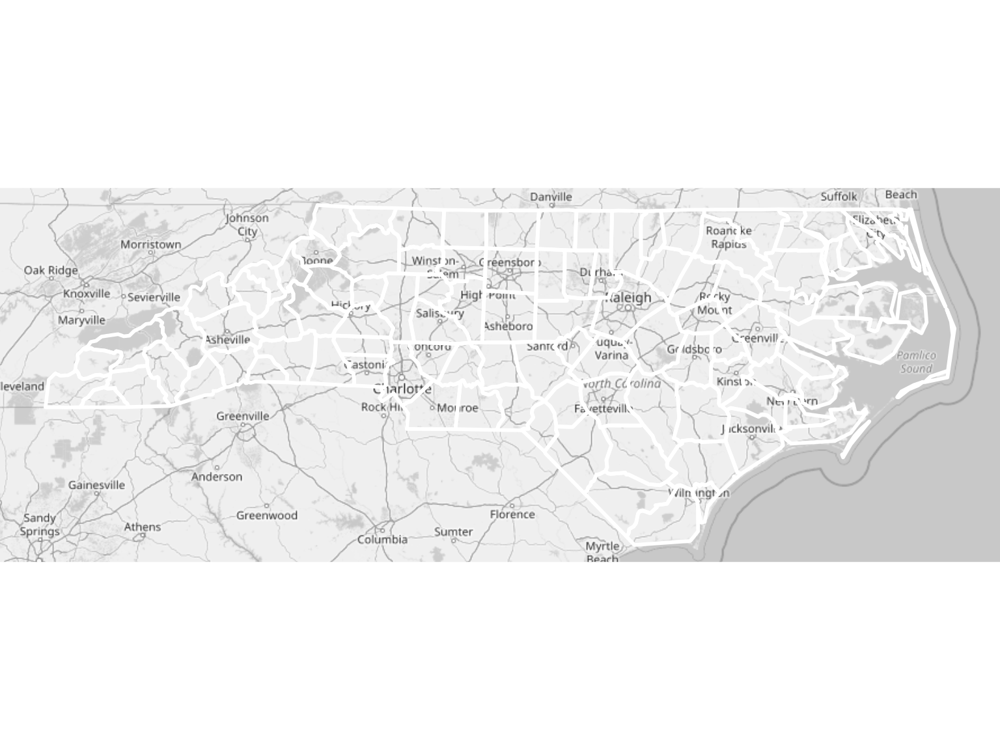
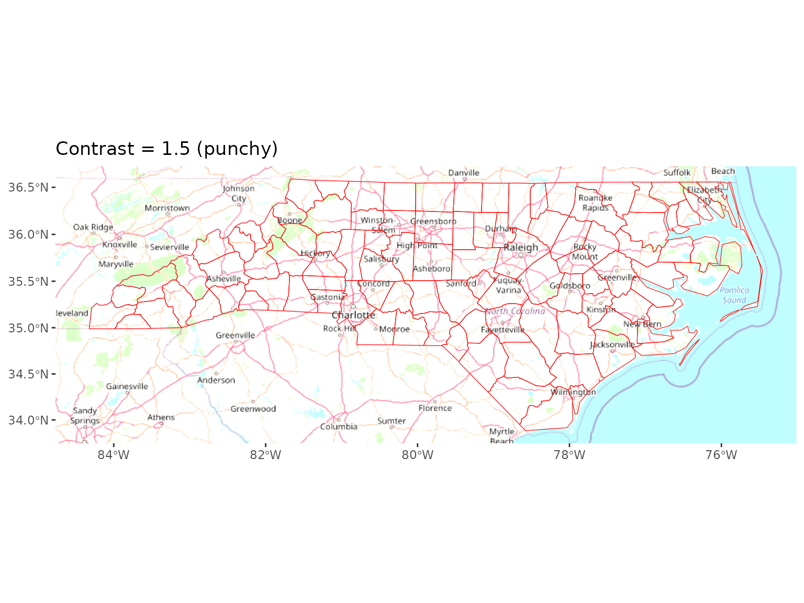
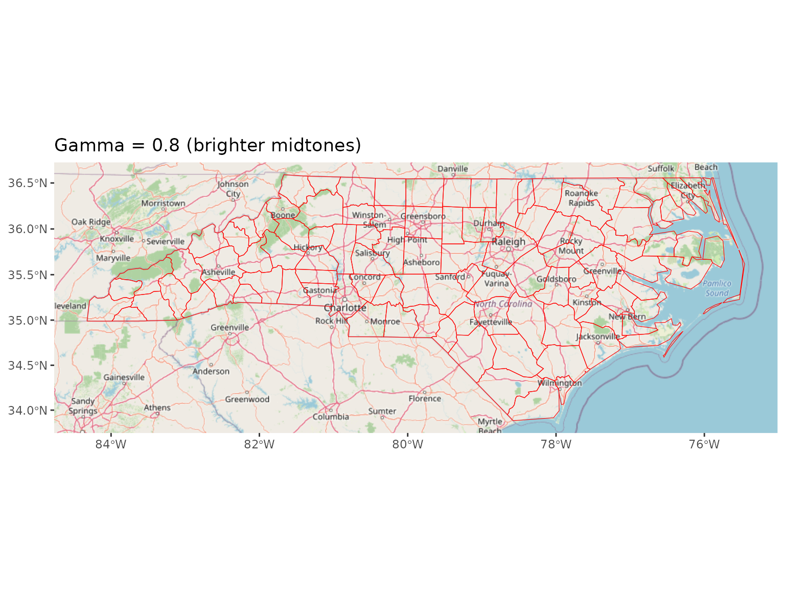
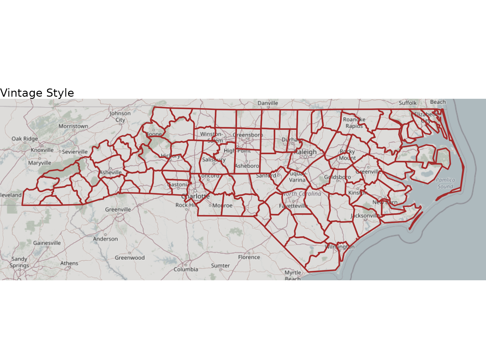
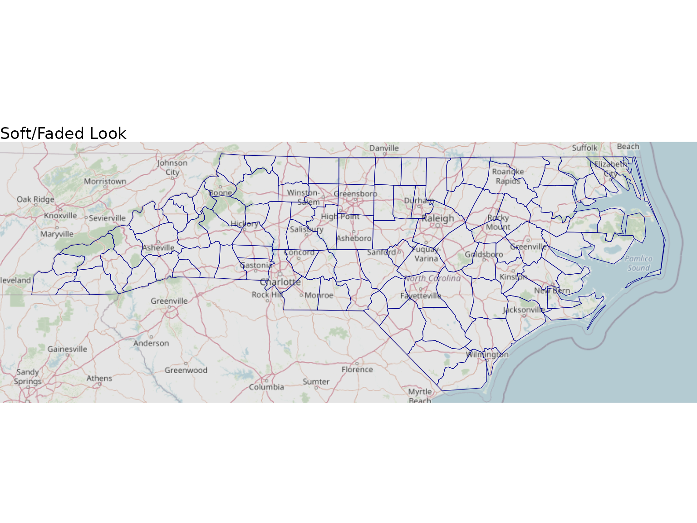
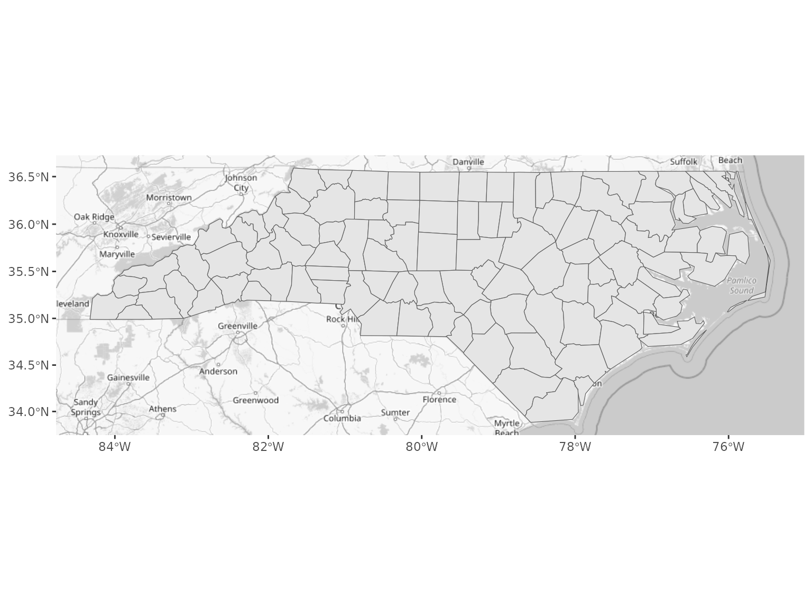
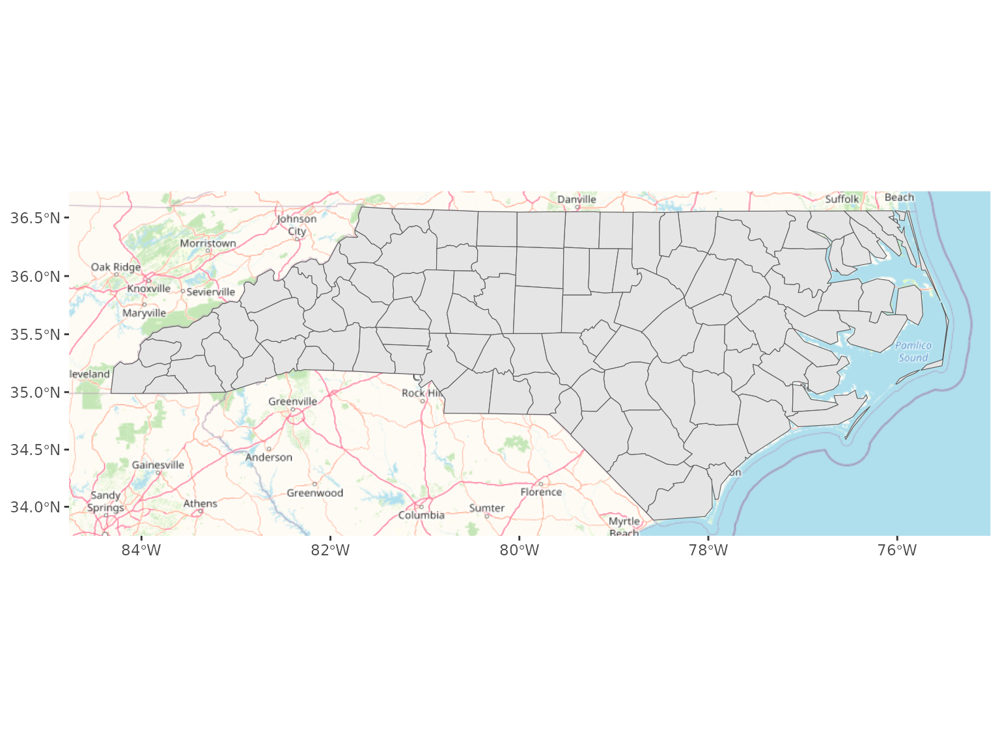

# Image Transformations

``` r
library(ggbasemap)
library(ggplot2)
library(sf)
#> Linking to GEOS 3.12.1, GDAL 3.8.4, PROJ 9.4.0; sf_use_s2() is TRUE

# Load sample data
nc <- st_read(system.file("shape/nc.shp", package = "sf"), quiet = TRUE)
```

## Introduction

**ggbasemap** provides powerful image transformation capabilities that
allow you to style your basemaps to match your visualization needs. You
can adjust grayscale, saturation, brightness, contrast, and gamma
correction.

## Available Transformations

### 1. Grayscale (Black & White)

Convert your basemap to black and white for a classic look:

``` r
ggplot() +
  add_basemap(nc, grayscale = TRUE) +
  geom_sf(data = nc, fill = NA, color = "white", linewidth = 1) +
  theme_void()
```



Grayscale basemap

This is perfect for: - Academic publications - Print media - When you
want data to stand out - Creating vintage-style maps

### 2. Saturation

Control the intensity of colors:

``` r
ggplot() +
  add_basemap(nc, saturation = 1) +
  geom_sf(data = nc, fill = NA, color = "red") +
  ggtitle("Saturation = 1 (default)")
```


Normal saturation

``` r
ggplot() +
  add_basemap(nc, saturation = 0.5) +
  geom_sf(data = nc, fill = NA, color = "red") +
  ggtitle("Saturation = 0.5")
```


Reduced saturation

### 3. Brightness

Adjust the overall lightness:

``` r
# Darker (-30%)
ggplot() +
  add_basemap(nc, brightness = 0.7) +
  geom_sf(data = nc, fill = NA, color = "yellow") +
  ggtitle("Brightness = 0.7 (darker)")
```


Adjusted brightness

### 4. Contrast

Enhance or reduce the difference between light and dark areas:

``` r
ggplot() +
  add_basemap(nc, contrast = 1.5) +
  geom_sf(data = nc, fill = NA, color = "red") +
  ggtitle("Contrast = 1.5 (punchy)")
```



High contrast

### 5. Gamma Correction

Adjust midtones without affecting blacks and whites:

``` r
ggplot() +
  add_basemap(nc, gamma = 0.8) +
  geom_sf(data = nc, fill = NA, color = "red") +
  ggtitle("Gamma = 0.8 (brighter midtones)")
```



Gamma correction

## Combining Transformations

The real power comes from combining multiple transformations:

### Vintage/Sepia Effect

``` r
ggplot() +
  add_basemap(nc,
              saturation = 0.3,
              brightness = 0.85,
              contrast = 1.2,
              gamma = 1.1) +
  geom_sf(data = nc, fill = NA, color = "brown", linewidth = 0.8) +
  theme_void() +
  ggtitle("Vintage Style")
```



Vintage style map

### High-Contrast Monochrome

``` r
ggplot() +
  add_basemap(nc,
              grayscale = TRUE,
              brightness = 1.1,
              contrast = 1.6) +
  geom_sf(data = nc, fill = NA, color = "black") +
  theme_void() +
  ggtitle("High-Contrast Monochrome")
```


High contrast monochrome

### Soft/Faded Look

``` r
ggplot() +
  add_basemap(nc,
              saturation = 0.6,
              brightness = 1.1,
              contrast = 0.8,
              gamma = 0.9) +
  geom_sf(data = nc, fill = NA, color = "darkblue") +
  theme_void() +
  ggtitle("Soft/Faded Look")
```



Soft faded look

### Data-Friendly Background

When you want your data to be the star:

``` r
ggplot() +
  add_basemap(nc,
              saturation = 0.2,
              brightness = 1.05,
              contrast = 0.9) +
  geom_sf(data = nc, 
          aes(fill = AREA),
          color = "white",
          linewidth = 0.3) +
  scale_fill_viridis_c() +
  theme_void() +
  ggtitle("Data-Friendly Background")
```


Data-friendly background

## Complete Reference Table

| Parameter    | Default | Range      | Effect                        |
|--------------|---------|------------|-------------------------------|
| `grayscale`  | FALSE   | TRUE/FALSE | Convert to B&W                |
| `saturation` | 1       | 0 to Inf   | Color intensity (0=grayscale) |
| `brightness` | 1       | 0 to Inf   | Overall lightness             |
| `contrast`   | 1       | 0 to Inf   | Difference between light/dark |
| `gamma`      | 1       | 0 to Inf   | Midtones adjustment           |

## Transformation Order

Transformations are applied in this order:

1.  **Gamma** (non-linear correction)
2.  **Brightness** (linear multiplication)
3.  **Contrast** (centered on 0.5)
4.  **Saturation** (color adjustment)
5.  **Grayscale** (final conversion if TRUE)

This order ensures the best visual results.

## Best Practices

### For Print Publications

``` r
ggplot() +
  add_basemap(nc,
              grayscale = TRUE,
              contrast = 1.2,
              brightness = 0.95) +
  geom_sf(data = nc)
```



Print-ready grayscale

### For Web/Digital Display

``` r
ggplot() +
  add_basemap(nc,
              saturation = 1.1,
              brightness = 1.05,
              contrast = 1.0) +
  geom_sf(data = nc)
```



Web-optimized colors

## Common Mistakes to Avoid

1.  **Don’t overdo it**: Extreme values (\>2 or \<0.3) usually look bad
2.  **Check your data**: Make sure your data colors work with the
    basemap
3.  **Test on different screens**: What looks good on your monitor might
    not on others

## Next Steps

- Read about **[Map
  Rotation](https://cedricbouffard.github.io/ggbasemap/articles/rotation.md)**
  to create angled perspectives
- Check the **FAQ** for common questions
